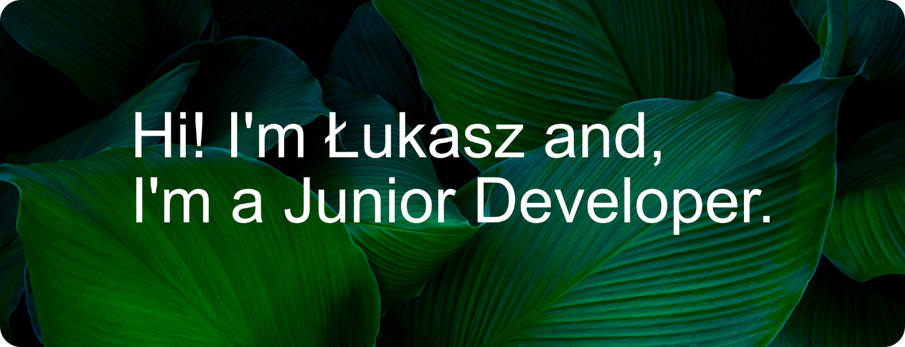

## 
**About me** 👀

 I’m currently working on nothing.

 I’m currently learning PHP basics.

 Do you have a question? You can ask me [here](https://github.com/lukasz-stepien-dev/lukasz-stepien-dev/issues).

## 
Stats 📊

<!--
**lukasz-stepien-dev/lukasz-stepien-dev** is a ✨ _special_ ✨ repository because its `README.md` (this file) appears on your GitHub profile.

Here are some ideas to get you started:

- 👯 I’m looking to collaborate on ...
- 🤔 I’m looking for help with finding great books.
- 📫 How to reach me: ...
- 😄 Pronouns: ...
- ⚡ Fun fact: ...
-->
