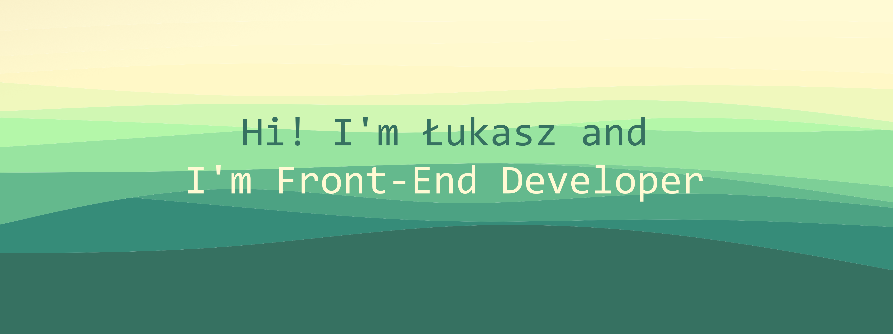

##### **About me** 👀

🔭 I’m currently working on [Interactive Card Form](https://github.com/lukasz-stepien-dev/Interactive-Card-Form).

🌱 I’m currently learning JQuery.

<!--
**lukasz-stepien-dev/lukasz-stepien-dev** is a ✨ _special_ ✨ repository because its `README.md` (this file) appears on your GitHub profile.

Here are some ideas to get you started:

- 👯 I’m looking to collaborate on ...
- 🤔 I’m looking for help with finding great books.
- 💬 Are you have a question? You can ask me [here](https://github.com/lukasz-stepien-dev/lukasz-stepien-dev/issues).
- 📫 How to reach me: ...
- 😄 Pronouns: ...
- ⚡ Fun fact: ...
-->
